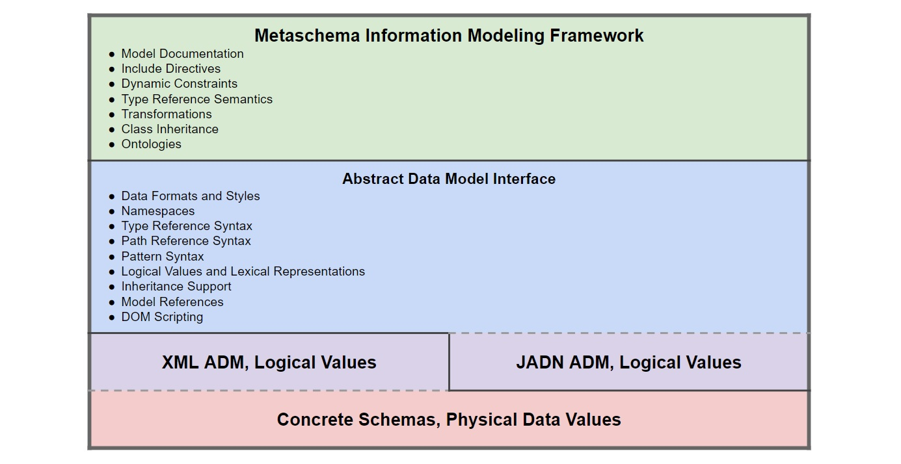

# Metaschema and Data Models

The [Metaschema Information Modeling Framework](https://pages.nist.gov/metaschema/):

> provides a common, format-agnostic modeling framework supporting schema, code,
> and documentation generation all in one".
>
> Current modeling technologies (i.e. XML Schema, JSON Schema, Schematron) are:
> * Uneven in their modeling expressiveness and validation capability
> * Bound to specific formats (i.e., XML, JSON, YAML)

The Metaschema framework includes a "built-in data model". But RFC 3444 distinguishes between:
* **Information Model**: models managed objects in a manner independent of data transport details,
can be specified informally or by using a formal Abstract Data Modeling language such as UML, ASN.1, or JADN
* **Data Model**: models data objects using a Concrete Data Modeling language such as XSD for XML data,
JSON Schema for JSON data, or CDDL for CBOR data.

Figure 1 conceptually divides an information modeling framework into three layers:
1. Concrete schemas and format-specific data (the Data Model)
2. Abstract schemas and format-agnostic application state (the Information Model)
3. Everything else including documentation and transformations (the Framework)

Metaschema currently uses XSD-defined elements without a clear separation between
the data and information layers, while JADN uses UML-based elements for the information
layer and formally-defined transformations/bindings between logical information instances
and physical/lexical data instances.

The purpose of this note is to explore defining an Abstract Data Model API between the
Framework and Information/Data layers so that Framework functions can be applied to
any information modeling technology that supports the API. The topics listed below
are candidate API capabilities, subject to addition, modification or deletion as warranted
by further research.

## Documentation

## Includes vs. Imports

## Data Formats and Styles

## Namespaced Type References

## Path-based Field References

## Regex Pattern Anchoring

## Logical Values vs. Lexical Representations

## Type Inheritance

## Model References