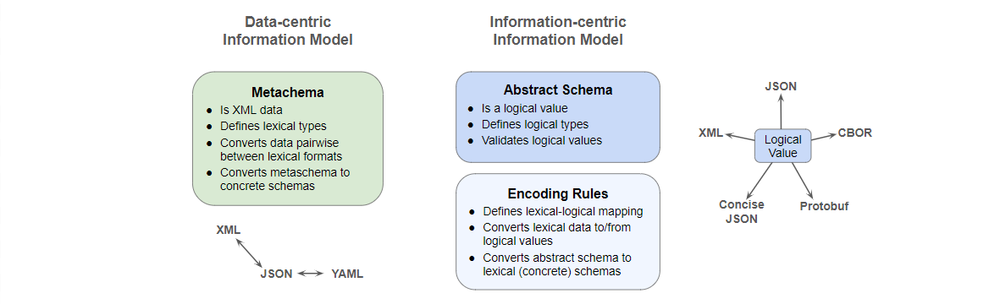

# An Abstract OSCAL Information Model

The NIST Open Security Controls Assessment Language ([OSCAL](https://pages.nist.gov/OSCAL/))
is defined using NIST [Metaschema](https://pages.nist.gov/metaschema/),
a data-centric information modeling framework.

Abstract information modeling methods are also available, including
* Abstract Syntax Notation number One ([ASN.1](https://www.itu.int/en/ITU-T/asn1/Pages/introduction.aspx)),
* Financial Information Exchange ([FIX](https://www.fixtrading.org/standards/)), and
* OASIS JSON Abstract Data Notation ([JADN](https://github.com/oasis-tcs/openc2-jadn/blob/working/jadn-v1.1.md))

This note describes information modeling approaches and contrasts them using OSCAL as a non-trivial
example and JADN as an IM to illustrate their differences in a practical application.

## 1 Background

> Metaschema is a framework for consistently organizing information into machine-readable data formats.  
The Metaschema Information Modeling Framework provides a means to represent an information model
for a given information domain, consisting of many related information elements, in a data format
neutral form. By abstracting information modeling away from data format specific forms,
the Metaschema Information Modeling Framework provides a means to consistently and sustainably
maintain an information model, while avoiding the need to maintain each derivative data format individually.

Although Metaschema performs abstraction by defining a data format neutral form, it is an
abstract "information model", not an "abstract information" model, because its building blocks -
Assemblies, Fields and Flags - are defined in XML and implemented by performing transformations on XML data.

> An Information Model defines the essential content of messages used in computing,
independently of how those messages are represented (i.e., serialized) for communication or storage.
The core purpose of an IM is to define information equivalence. This allows the essential content
of data values to be compared for equality regardless of format, and enables hub-and-spoke
lossless translation across formats.

In a model of "abstract information", types and instances exist within applications independently
of any data format, and exist even if no data formats have been defined.
Transformations between data formats are implemented by loading data into application information
then saving information back out to data.
Any method of loading and saving program state, such as Python's pickle, ECMAScript's JSON or Java's JAXB,
does so by marshalling or serializing program state into a data format.

JADN Information Definition Language (IDL) is a non-normative and non-exclusive domain-specific language
(DSL) used to load and store JADN information models without requiring JSON, XML, or other data format.
Other hypothetical DSLs, such as one that mimics the syntax of ASN.1 or the terse grammar of
[CDDL](https://datatracker.ietf.org/doc/html/rfc8610),
could represent the identical information models.

JADN defines a small set of abstract types that represent behavior commonly supported in programming languages
and commonly understood by programmers:
* Five primitive types: Binary, Boolean, Integer, Number, String
* One collection type: ArrayOf - with UML multiplicity semantics: Sequence, Set, OrderedSet, Bag
* Four collection member access types: Array, Record, Map, MapOf
* Two union types for selecting among alternatives: Enumerated, Choice

All abstract type definitions have the same program state: five values, one of which is a list of fields that
may be empty. Fields, when present, have five values except for enumerations which have three:
```
[TypeName, BaseType, [TypeOptions], TypeDescription, [Fields]]

if BaseType = Array, Record, or Map, Field is:
    [FieldID, FieldName, FieldType, [FieldOptions], FieldDescription]

if BaseType = Enumerated, Field is:
    [ItemID, ItemValue, ItemDescription]
```
A JADN information model is a set of these type definitions plus metadata about the set. The definitions
include options that specify both how information instances are validated and how they are serialized.



### 1.1 Data Modeling and Ontologies

Data modeling has a long rich history, with semantics defined by conceptual and logical data models
that represent information separately from physical storage format.


Ontologies express the semantics of and relationships among resources. Physical resources
are described by ontology nodes, while concrete digital resources (documents, messages, images, etc.)
can be both described by ontologies and defined by abstract information models composed of
[Datatypes](https://www.w3.org/TR/rdf12-concepts/#section-Datatypes),
("types whose instances are distinguished only by their value" -- UML). Datatypes
define the logical value of digital resources and their serialized representations, and
the ontology terminology of datatypes performing lexical-to-(logical)-value (L2V) mapping is a
novel and precise way of describing the difference between logical and lexical values.

Unfortunately the only datatypes supported by today's ontologies are primitives such as strings and numbers,
and the only supported lexical space is character strings.
Ontologies that extended the datatype lexical space to include byte strings, and extended datatype
support to simple structures (like CPE), complete messages, and documents would be able to define
L2V mappings for these digital resources, not just their relationships to other resources.

### 1.2 Common Platform Enumeration

Before getting to OSCAL, the Common Platform Enumeration
([CPE](https://nvlpubs.nist.gov/nistpubs/Legacy/IR/nistir7695.pdf))
is a clear illustration of the difference between logical and lexical values.
CPE is a compound datatype with an L2V mapping between well-formed names (WFNs) and lexical representations.
An abstract information model would define the CPE logical value in semantic terms:
* A CPE instance is a set of 12 defined fields
* The model designer can define CPE as either a Record type if field names are normative and optionally
included in some data formats, or an Array type if field names are annotations that can never appear
in lexical data, supporting natural language agnostic documents and protocols (I18N).
* The designer can designate Record, Map and Array semantics as sets or ordered sets, which
determines which serializations are possible.
* An L2V mapping from the 12-field logical WFN to a single-string lexical value would be defined using
format options such as /cpe-22 or /cpe-23.

Defining CPE using Metaschema would illustrate the significance of logical values in information modeling.

## 2 Metaschema and JADN Comparison

Information models

Significant (essential) vs. insignificant - communicating a WFN

12 JADN elements - 5 primitive, 5 collection, 2 union

UUID

Character and byte sequences, hex and base64 strings

### Conceptual modeling

Class instances exist without being serialized

### Every type is a Datatype
Data-centric approaches treat datatype as a synonym for primitive.  UUIDDatatype and EmailAddressDatatype are
redundant; UUID and EmailAddress are sufficient.

### No Properties or Flags
Primitives and Collections

### Packages and Bundles
Metaschema defines "combined" schemas and "unified model of models".

* JADN schemas are organized using packages
* **Package** has two fields
  * package context (package namespace, referenced namespaces, name, constraints, ...)
  * types defined within a package, all type names are qualified by the package namespace
  * a type definition can reference types from other packages
  * blank namespace prefixes allow types to be merged from multiple packages into a single package if contexts are compatible
* **Bundle** is a set of packages serialized together for transmission or storage
  * has no logical value: no id, no nesting, no association among packages, no persistent group after parsing

## 3 Modeling OSCAL in JADN

A conceptual OSCAL IM can be defined based on the OSCAL top-level description:


This conceptual JADN design minimizes duplication - the overall model structure is defined once
as opposed to the OSCAL designer's approach of repeating the same Metaschema structure in each of the models.
A goal of any information modeling language is not to impose a design philosophy but to provide the
expressive power to allow model designers to communicate their intent unambiguously, clearly and succinctly.

The actual JADN information model for OSCAL matches the published OSCAL specification, which does not require
content to appear in any particular order. Back-matter could appear at the front of an OSCAL document,
or Metadata after the Body, because Metaschema Assembly definitions do not impose a serialization order.
A JADN IM can define field ordering if that is the designer's intent, but implementing it in JSON Schema
would require a change to the serialization format.

```
       title: "OSCAL"
     package: "https://example.gov/ns/oscal/0.0.1/"
 description: "OSCAL - Open Security Controls Assessment Language concept"
  namespaces: [["", "https://example.gov/ns/oscal/0.0.1/metadata/"],
               ["", "https://example.gov/ns/oscal/0.0.1/catalog/"],
               ["", "https://example.gov/ns/oscal/0.0.1/profile/"],
               ["", "https://example.gov/ns/oscal/0.0.1/component/"],
               ["", "https://example.gov/ns/oscal/0.0.1/ssp/"],
               ["", "https://example.gov/ns/oscal/0.0.1/assessment-plan/"],
               ["", "https://example.gov/ns/oscal/0.0.1/assessment-results/"],
               ["", "https://example.gov/ns/oscal/0.0.1/poam/"],
               ["", "https://example.gov/ns/oscal/0.0.1/back-matter/"]]
       roots: ["OSCAL"]

OSCAL = Record sequence                              // OSCAL document - seq option requires content to appear in defined order
   1 model            Enumerated(Enum[Model])        // OSCAL model identifier
   2 uuid             UUID                           // Document instance unique identifier
   3 metadata         Metadata                       // Identifying info, roles, parties and locations
   4 body             Model(Tag[model])              // Model-specific body
   5 back_matter      Back-matter optional           // Linked and attached resources

Model = Choice                                       // Model-specific content
   1 catalog          Catalog                        // Control layer: catalog of controls
   2 profile          Profile                        // Control layer: selecting, organizing and tailoring a set of controls
   3 component        Component                      // Implementation layer: component definition and configuration
   4 ssp              System-security-plan           // Implementation layer: security implementation of an information system
   5 ap               Assessment-plan                // Assessment layer: scope and activities
   6 ar               Assessment-results             // Assessment layer: information produced from assessment activities
   7 poam             Plan-of-action-and-milestones  // Assessment layer: Plan of action and milestones: findings to be addressed by system owner
```

After understanding the differences in approach and demonstrating JADN's ability to validate existing OSCAL data,
the question remains: what advantages does it have in this application?  
A minimal set of logical types is easier to describe, understand, and edit.
Logical types are essential content -> bare HTML, encoding rules add implementation detail -> css

Example: Assessment plan unique constraint on component and user (uses key).  Logical: is_unique, has_key. Lexical: serialized as map or list.

## 4 Summary
| Feature           | JADN                                            | Metaschema                              |
|-------------------|-------------------------------------------------|-----------------------------------------|
| Model definition  | IDL or serialized as data in any format         | XML data                                |
| Model instance    | Logical value: state in an application          | Data value: XML                         | 
| Data translation  | Hub/spoke (data->logical->data): N translations | Star (data->data): N^2 translations     |
| Information       | Logical model defines significant content       | Insignificant content is undefined      |
| Datatypes         | Every type is a datatype                        | Only primitives (flags) are Datatypes   |
| Type names        | Every type has a name                           | Anonymous (nested) types are allowed    |
| Type references   | Single id format: ns:Type.field                 | Multiple id formats                     |
| Fields/Properties | Assembly binds local id/name to type            | Field names are bound globally to types |
| Field names       | Enumerated (numeric id and text name/label)     | Text name only                          |
| Field order       | Assemblies are ordered or unordered set         | Assemblies are only unordered set       |
| Data formats      | Character sequence (text) or byte sequence      | Character sequence only                 |
| Packaging         | Models can be grouped in non-semantic bundles   | Types from multiple models can be mixed |
| Documentation     | Short comments, external docs incorporate types | Type definitions include documentation  |