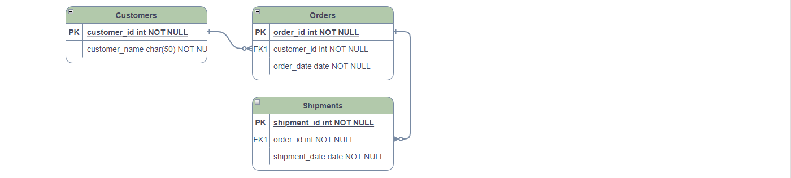

# OSCAL Information Modeling with JADN

The NIST Open Security Controls Assessment Language (OSCAL) is defined using NIST Metaschema.
OSCAL can also be defined using OASIS JSON Abstract Data Notation 
([JADN](https://github.com/oasis-tcs/openc2-jadn/blob/working/jadn-v1.1.md)).
This paper describes information modeling approaches and contrasts them using OSCAL as a non-trivial
example that illustrates their differences in practical applications.

## Data-centric vs. Information-centric Information Modeling

Metaschema is a *data-centric* information modeling approach:

> Metaschema is a framework for consistently organizing information into machine-readable data formats.  
>
>The Metaschema Information Modeling Framework provides a means to represent an information model
for a given information domain, consisting of many related information elements, in a data format
neutral form. By abstracting information modeling away from data format specific forms,
the Metaschema Information Modeling Framework provides a means to consistently and sustainably
maintain an information model, while avoiding the need to maintain each derivative data format individually.

JADN is an *information-centric* information modeling approach:

> An Information Model defines the *essential content* of messages used in computing,
independently of how those messages are represented (i.e., serialized) for communication or storage.
>
> The core purpose of an IM is to define information equivalence. This allows the essential content
of data values to be compared for equality regardless of format, and enables hub-and-spoke
lossless translation across formats. 

These are similar in purpose - all information models define information elements
in a data format neutral form. But the approaches differ in the meaning of *information element*.
Metaschema elements are instances of transmitted or stored data,
while JADN elements are instances of logical values with a specified meaning.

CPE well-formed names - definition of "logical" and "binding", JADN Record specifies both order and attributes; a
WFN is logically an (unordered) set of attributes, but ordered bindings are supported.
https://nvlpubs.nist.gov/nistpubs/Legacy/IR/nistir7695.pdf
Record vs. Array - attributes have normative names vs. natural language independent labels

## JADN Description

Information models 

12 JADN elements - 5 primitive, 5 collection, 2 union

UUID

Character and byte sequences, hex and base64 strings

### Conceptual modeling
No data required

Class instances exist without being serialized

### Every type is a Datatype
Data-centric approaches treat datatype as a synonym for primitive.  UUIDDatatype and EmailAddressDatatype are
redundant; UUID and EmailAddress are sufficient.

### No Properties or Flags
Primitives and Collections

### Packages and Bundles
Metaschema defines "combined" schemas and "unified model of models".

* JADN schemas are organized using packages
* **Package** has two fields
  * package context (package namespace, referenced namespaces, name, constraints, ...)
  * types defined within a package, all type names are qualified by the package namespace
  * a type definition can reference types from other packages
  * blank namespace prefixes allow types to be merged from multiple packages into a single package if contexts are compatible
* **Bundle** is a set of packages serialized together for transmission or storage
  * has no logical value: no id, no nesting, no association among packages, no persistent group after parsing

## Metaschema and JADN Comparison

### Data-centric

Metaschema models are defined as XML data.

### Information-centric
Because a JADN IM is a logical value, it can be serialized in any data format, but does not need to be
serialized in any data format. This is useful when doing conceptual design; it allows an IM to be created
and documented in a domain-specific language (DSL) without using XML or other serialized data. JADN DSLs are
neither normative nor exclusive:
* The normative structure of a JADN IM is application state that exhibits the required behavior.
An IM can be instantiated within applications as, for example, a
[single variable](../../Images/oscal-concept-schema.jpg) or set of class variables.
* JADN Information Definition Language (IDL) is a DSL used to represent JADN information models.
Other hypothetical DSLs, such as one that mimics the syntax of ASN.1 or the terse grammar of
[CDDL](https://datatracker.ietf.org/doc/html/rfc8610),
could represent the identical application state.
*  The small number and regular structure of JADN elements facilitates design of both DSLs and serialized data formats.

A conceptual OSCAL IM can be defined in JADN IDL from the OSCAL top-level description:


This conceptual JADN design minimizes duplication - the overall model structure is defined once
as opposed to the OSCAL designer's approach of repeating the same Metaschema structure in each of the models.
A goal of any information modeling language is not to impose a design philosophy but to provide the
expressive power to allow model designers to communicate their intent unambiguously, clearly and succinctly.

The actual JADN information model for OSCAL matches the published OSCAL specification, which does not require
content to appear in any particular order. Back-matter could appear at the front of an OSCAL document,
or Metadata after the Body, because Metaschema Assembly definitions do not impose a serialization order.
A JADN IM can define field ordering if that is the designer's intent.

```
       title: "OSCAL"
     package: "https://example.gov/ns/oscal/0.0.1/"
 description: "OSCAL - Open Security Controls Assessment Language concept"
  namespaces: [["", "https://example.gov/ns/oscal/0.0.1/metadata/"],
               ["", "https://example.gov/ns/oscal/0.0.1/catalog/"],
               ["", "https://example.gov/ns/oscal/0.0.1/profile/"],
               ["", "https://example.gov/ns/oscal/0.0.1/component/"],
               ["", "https://example.gov/ns/oscal/0.0.1/ssp/"],
               ["", "https://example.gov/ns/oscal/0.0.1/assessment-plan/"],
               ["", "https://example.gov/ns/oscal/0.0.1/assessment-results/"],
               ["", "https://example.gov/ns/oscal/0.0.1/poam/"],
               ["", "https://example.gov/ns/oscal/0.0.1/back-matter/"]]
       roots: ["OSCAL"]

OSCAL = Record sequence                              // OSCAL document - seq option requires content to appear in defined order
   1 model            Enumerated(Enum[Model])        // OSCAL model identifier
   2 uuid             UUID                           // Document instance unique identifier
   3 metadata         Metadata                       // Identifying info, roles, parties and locations
   4 body             Model(Tag[model])              // Model-specific body
   5 back_matter      Back-matter optional           // Linked and attached resources

Model = Choice                                       // Model-specific content
   1 catalog          Catalog                        // Control layer: catalog of controls
   2 profile          Profile                        // Control layer: selecting, organizing and tailoring a set of controls
   3 component        Component                      // Implementation layer: component definition and configuration
   4 ssp              System-security-plan           // Implementation layer: security implementation of an information system
   5 ap               Assessment-plan                // Assessment layer: scope and activities
   6 ar               Assessment-results             // Assessment layer: information produced from assessment activities
   7 poam             Plan-of-action-and-milestones  // Assessment layer: Plan of action and milestones: findings to be addressed by system owner
```



## Summary
| Feature           | JADN                                            | Metaschema                              |
|-------------------|-------------------------------------------------|-----------------------------------------|
| Model definition  | IDL or serialized as data in any format         | XML data                                |
| Model instance    | Logical value: state in an application          | Data value: XML                         | 
| Data translation  | Hub/spoke (data->logical->data): N translations | Star (data->data): N^2 translations     |
| Information       | Logical model defines significant content       | Insignificant content is undefined      |
| Datatypes         | Every type is a datatype                        | Only primitives (flags) are Datatypes   |
| Fields/Properties | Assembly binds local name to type               | Field names are bound globally to types |
| Field names       | Enumerated (numeric id and text name/label)     | Text name only                          |
| Field order       | Assemblies are ordered or unordered set         | Assemblies are an unordered set         |
| Data formats      | Character sequence (text) or byte sequence      | Character sequence only                 |
| Packaging         | Models can be grouped in non-semantic bundles   | Types from multiple models can be mixed |