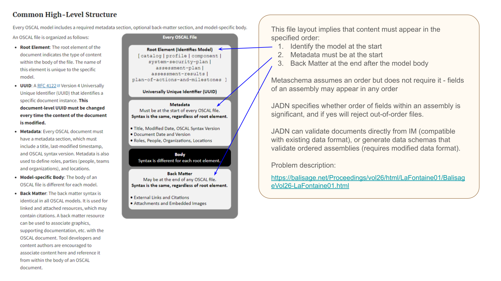

# An Abstract OSCAL Information Model

The NIST Open Security Controls Assessment Language ([OSCAL](https://pages.nist.gov/OSCAL/))
is defined using NIST [Metaschema](https://pages.nist.gov/metaschema/),
a data-centric information modeling framework.

Abstract information modeling methods are also available, including
* Abstract Syntax Notation number One ([ASN.1](https://www.itu.int/en/ITU-T/asn1/Pages/introduction.aspx)),
* Financial Information Exchange ([FIX](https://www.fixtrading.org/standards/)), and
* OASIS JSON Abstract Data Notation ([JADN](https://github.com/oasis-tcs/openc2-jadn/blob/working/jadn-v1.1.md))

This note discusses information modeling approaches and contrasts them using OSCAL as a non-trivial
example and JADN as an IM to illustrate their differences in a practical application.

## 1 Background
### 1.1 Data Abstraction

> Metaschema is a framework for consistently organizing information into machine-readable data formats.  
The Metaschema Information Modeling Framework provides a means to represent an information model
for a given information domain, consisting of many related information elements, in a data format
neutral form. By abstracting information modeling away from data format specific forms,
the Metaschema Information Modeling Framework provides a means to consistently and sustainably
maintain an information model, while avoiding the need to maintain each derivative data format individually.

Although Metaschema performs abstraction by defining a data format neutral form, it is an
abstract "information model", not an "abstract information" model, because its building blocks -
Assemblies, Fields and Flags - are defined in XML and implemented by performing transformations on XML data.

### 1.2 Logical Types

> An Information Model defines the essential content of messages used in computing,
independently of how those messages are represented (i.e., serialized) for communication or storage.
The core purpose of an IM is to define information equivalence. This allows the essential content
of data values to be compared for equality regardless of format, and enables hub-and-spoke
lossless translation across formats.

In an "abstract information" model, types and instances that define the model exist as application
state independently of any data format, and can be used even if no data formats exist.

For data defined by an IM, transformations between data formats are implemented by loading data
into an application's logical values, validating the logical values against the appropriate IM,
then saving the logical values back out as data.


#### 1.2.1 Abstract Schema

JADN defines a small set of abstract types that represent behavior commonly supported in programming languages
and commonly understood by programmers:
* Five **primitive** types: Binary, Boolean, Integer, Number, String
* One **compound** type: ArrayOf (with UML multiplicity semantics: Sequence, Set, OrderedSet, Bag)
* Four **mapped compound** types: Array, Record, Map, MapOf (also with UML multiplicity semantics)
* Two **union** types for selecting among alternatives: Enumerated, Choice

All abstract type definitions have the identical structure: five-tuples, one of which is a tuple of fields that
may be empty. Fields, when present, are five-tuples except for enumerations which are three-tuples:
```
(TypeName, BaseType, (TypeOptions), TypeDescription, (Fields))

    if BaseType == Array, Record, Map, or Choice, Field is:
    (FieldID, FieldName, FieldType, (FieldOptions), FieldDescription)

    if BaseType == Enumerated, Field is:
    (ItemID, ItemValue, ItemDescription)
```
The "n-tuple" notation denotes an immutable value, an instance of a constant rather than a variable.
This is because the schema is composed of datatypes:

> "DataTypes model Types whose instances are distinguished only by their value",
and "All instances of a DataType with the same value are considered to be equal instances."

-- [UML](https://www.omg.org/spec/UML/2.5/PDF/) section 10.2.

A different constant is by definition a different instance, whereas two variables might be
mistakenly considered the same instance even if values within them were different.
This could occur due to references being treated as equivalent to data being referenced,
or even if external references to a collection are treated as adding members to it.
A document is useful only if it is defined to be an immutable lexical value that could
in principle be hashed or signed, unaffected by anything that exists outside that value
now or in the future.

An abstract schema is a set of datatypes in a package, plus package metadata. The type definitions
include options that specify both how information instances are validated and how they are serialized.

#### 1.2.2 IM Serialization

Any method of loading and saving program state, such as Python's pickle, ECMAScript's JSON or Java's JAXB,
does so by marshalling or serializing program state into a data format. Because an abstract schema is
a logical value, it can be serialized using any language-specific or language-agnostic data format
supported by the operating environment.

And because logical values are program state, an abstract schema can also be loaded and saved using a
schema's domain-specific language (DSL). 
JADN Information Definition Language (IDL) is a non-normative and non-exclusive DSL used to load
and store JADN schemas without using JSON, XML, or other generic data format.
Other hypothetical DSLs, such as one that mimics the syntax of ASN.1 or the terse grammar of
[CDDL](https://datatracker.ietf.org/doc/html/rfc8610),
could represent the identical schemas. The minimalist structure of JADN combine with the ability
to optimize one or more DSLs to make JADN an effective tool for understanding and defining
information models.

### 1.3 Data Modeling and Ontologies

The concept that logical types and instances exist independently of physical data is not new.
Data modeling has a long rich history, with semantics defined by conceptual and logical data models
that represent information at a higher layer of abstraction than physical data.


Ontologies express the semantics of and relationships among resources. Physical resources
are described by ontology nodes, while digital resources (documents, messages, images, etc.)
can be both described by ontologies and defined by abstract information models composed of
[Datatypes](https://www.w3.org/TR/rdf12-concepts/#section-Datatypes). Datatypes
define the logical value of a digital resource and its serialized representations, and
the ontology terminology of datatypes performing lexical-to-(logical)-value (L2V) mapping is a
novel and precise way of describing the difference between logical and physical values.

Unfortunately the only datatypes supported by today's ontologies are primitives such as
strings and numbers, and the only lexical space is character strings.

Ontologies that extend the lexical space to include byte strings, and extend datatypes to
support simple structures, complete messages, and documents would be able to define
the lexical values of digital resources instead of just describing them and their relationships
to other resources.

### 1.4 Common Platform Enumeration

Before getting to OSCAL, the Common Platform Enumeration
([CPE](https://nvlpubs.nist.gov/nistpubs/Legacy/IR/nistir7695.pdf))
is a simple illustration of the difference between logical and lexical values.
CPE is a compound datatype with an L2V mapping between well-formed names (WFNs) and lexical representations.
An abstract information model would define the CPE logical value in semantic terms:
* A CPE instance is a set of 12 defined fields
* The model designer can define CPE as either a Record type if field names are normative and optionally
included in some data formats, or an Array type if field names are annotations that can never appear
in lexical data, supporting natural language agnostic documents and protocols (I18N).
* The designer can designate Record, Map and Array semantics as sets or ordered sets, which
determines which serializations are possible.
* An L2V mapping from the 12-field logical WFN to a single-string lexical value would be defined using
format options such as /cpe-22 or /cpe-23.

Defining CPE using Metaschema would illustrate the significance of logical values in information modeling.

## 2 Metaschema and JADN Comparison

In addition to the abstraction approach, there are some specific differences between Metaschema and JADN

### 2.1 Datatypes

Metaschema treats datatype as a synonym for primitive. Every JADN type is a datatype, thus UUIDDatatype,
EmailAddressDatatype and the like are redundantly named; UUID and EmailAddress would be sufficient.

### 2.2 Fields

Metaschema treats fields as having an independent existence akin to assemblies. JADN has no such thing as
a field type. Its compound types are composed of other types, and fields within a compound type have:
1. a name/id with local scope, and
2. any type

There is no difference between a primitive, compound or union type that appears as a field in one or more
types and one that does not.

### 2.3 Flags

Metaschema treats flags as being pre-defined primitive types. JADN has only five primitive types; all subtypes
of those five must be defined in a schema like all other types. A "common types" schema can be defined as
a library for other schemas to use, but it still must be created and referenced like all other schemas,
only the 12 types listed above are built into the definition of JADN.

### 2.3 Packages and Bundles
Metaschema defines "combined" schemas and "unified model of models".

JADN schemas are organized using packages. There is no combination of packages other than being bundled together.
* **Package** has two fields:
  * "info": context header (package namespace, referenced namespaces, root types, name, constraints, ...)
  * "types": types defined within the package
* type definitions can reference types from other packages by their namespace
* blank namespace prefixes allow packages to be merged into a single package if type names are unique and contexts are compatible


* **Bundle** is a set of packages packed together for transmission or storage
  * a bundle has no logical value: no id, no nesting, no association among packages, no persistent grouping after being unpacked
  * a bundle can be implemented by an archiver such as zip or tar, or by concatenating package content as in JSON streaming

### 2.4

Character and byte sequences, hex and base64 strings

## 3 Modeling OSCAL in JADN

When beginning the OSCAL project, a conceptual IM could be defined based on the OSCAL top-level description:



This conceptual JADN design minimizes duplication - the overall model structure is defined once
as opposed to the OSCAL designer's approach of repeating the same Metaschema structure in each of the models.
A goal of any information modeling language is not to impose a design philosophy but to provide the
expressive power to allow model designers to communicate their intent unambiguously, clearly and succinctly.

The actual JADN information model for OSCAL uses a different pattern that matches the published OSCAL
specification, which does not require content to appear in any particular order. Back-matter could appear
at the front of an OSCAL document, or Metadata after the Body, because the current Metaschema does not
impose a serialization order. A JADN IM can define field ordering if that is the designer's intent,
but implementing it in JSON Schema would require a change to the serialization format.

```
       title: "OSCAL"
     package: "https://example.gov/ns/oscal/0.0.1/"
 description: "OSCAL - Open Security Controls Assessment Language concept"
  namespaces: [["", "https://example.gov/ns/oscal/0.0.1/metadata/"],
               ["", "https://example.gov/ns/oscal/0.0.1/catalog/"],
               ["", "https://example.gov/ns/oscal/0.0.1/profile/"],
               ["", "https://example.gov/ns/oscal/0.0.1/component/"],
               ["", "https://example.gov/ns/oscal/0.0.1/ssp/"],
               ["", "https://example.gov/ns/oscal/0.0.1/assessment-plan/"],
               ["", "https://example.gov/ns/oscal/0.0.1/assessment-results/"],
               ["", "https://example.gov/ns/oscal/0.0.1/poam/"],
               ["", "https://example.gov/ns/oscal/0.0.1/back-matter/"]]
       roots: ["OSCAL"]

OSCAL = Record sequence                              // OSCAL document - seq option requires content to appear in defined order
   1 model            Enumerated(Enum[Model])        // OSCAL model identifier
   2 uuid             UUID                           // Document instance unique identifier
   3 metadata         Metadata                       // Identifying info, roles, parties and locations
   4 body             Model(Tag[model])              // Model-specific body
   5 back_matter      Back-matter optional           // Linked and attached resources

Model = Choice                                       // Model-specific content
   1 catalog          Catalog                        // Control layer: catalog of controls
   2 profile          Profile                        // Control layer: selecting, organizing and tailoring a set of controls
   3 component        Component                      // Implementation layer: component definition and configuration
   4 ssp              System-security-plan           // Implementation layer: security implementation of an information system
   5 ap               Assessment-plan                // Assessment layer: scope and activities
   6 ar               Assessment-results             // Assessment layer: information produced from assessment activities
   7 poam             Plan-of-action-and-milestones  // Assessment layer: Plan of action and milestones: findings to be addressed by system owner
```

After understanding the differences in approach and demonstrating JADN's ability to validate existing OSCAL data,
the question remains: what advantages does it have in this application?  
A minimal set of logical types is easier to describe, understand, and edit.
Logical types are essential content -> bare HTML, encoding rules add implementation detail -> css

Example: Assessment plan unique constraint on component and user (uses key).  Logical: is_unique, has_key. Lexical: serialized as map or list.

## 4 Summary
| Feature                                          | JADN                                            | Metaschema                              |
|--------------------------------------------------|-------------------------------------------------|-----------------------------------------|
| [Model instance](#12-logical-types)              | Logical value: state in an application          | Data value: XML                         | 
| [Data translation](#12-logical-types)            | Hub/spoke (data->logical->data): N translations | Star (data->data): N^2 translations     |
| [Datatypes](#121-abstract-schema)                | Every type is a datatype                        | Only primitives (flags) are Datatypes   |
| [Model definition](#122-im-serialization)        | IDL or serialized as data in any format         | XML data                                |
| [Data formats](#13-data-modeling-and-ontologies) | Character sequence (text) or byte sequence      | Character sequence only                 |
| [Fields/Properties](#22-fields)                  | Assembly binds local id/name to type            | Field names are bound globally to types |
| [Packaging](#23-packages-and-bundles)            | Models can be grouped in non-semantic bundles   | Types from multiple models can be mixed |
| [Field order](#3-modeling-oscal-in-jadn)         | Assemblies are ordered or unordered sets        | Assemblies are only unordered sets      |
| Information                                      | Logical model defines significant content       | Insignificant content is undefined      |
| Type names                                       | Every type has a name                           | Anonymous (nested) types are allowed    |
| Type references                                  | Single id format: ns:Type.field                 | Multiple id formats                     |
| Field names                                      | Enumerated (numeric id and text name/label)     | Text name only                          |
| Documentation                                    | Short line comments, docs in header or external | Type definitions include documentation  |